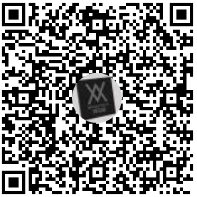
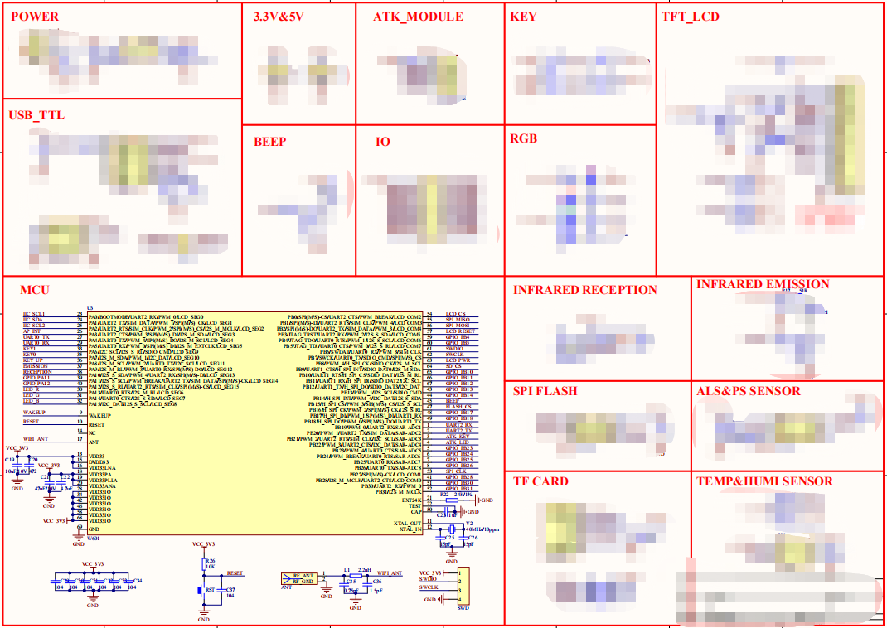

W600 Arduino测试活动送RT-Thread W601开发板
==========================================

1.活动介绍
----------

为了促进 **联盛德 W600 WIFI
SOC**\ 的多元化发展，为用户提供更多更便捷的开发方式，官方推出了W600
Arduino发行版SDK开发包，并推出“你测试，我送开发板”的活动。

W600 Arduino 资料链接：http://w600.fun/development/arduino/start/

北京联盛德微电子有限责任公司官网：http://www.winnermicro.com/

2.活动时间
----------

2019年5月21日 至 2019年6月16日23点59分。

3.活动规则
----------

1.Show出您的精彩操作
~~~~~~~~~~~~~~~~~~~~

开发者提供 W600 Arduino的相关测试教程或者基于W600 Arduino的小项目。

-  教程的完整性，图文结合，步骤清晰；
-  教程的实用性，能够引导新人开发者上手；
-  项目具备一定的展示性和可操作性，开源最好；

2.Show出您的宝贵建议
~~~~~~~~~~~~~~~~~~~~

开发者在使用W600
Arduino的过程中，有遇到的问题或者认为可以改进的方面，请参考投稿方式投稿，专人处理。

-  遇到的问题，请图文描述清楚问题点，提供复现方式，或者演示代码；
-  可改进方面，请图文描述您的宝贵建议，可以适当对比其他芯片的Arduino开发资源；

4.投稿方式
----------

投稿方式通过邮箱投稿自己的教程、项目、建议等，由我司统一评估、审核。

**投稿邮箱：**\ support@thingsturn.com

**其他联系方式**\ ：QQ群：860320067 联系群管理。

5.投稿格式
----------

1.邮件正文附上教程或者项目链接，链接可为论坛、CSDN等可查阅的有效链接。

2.投稿链接文章标题必须要有
“W600”的字样，尽量要有“教程”、“文档”、等字样，参考示例“W600 Arduino
快捷入门/使用指南/入门教程/测试文档” “使用W600 Arduino 制作 xxx
开源项目” “三分钟玩转 W600 Arduino”等等。

3.参与投稿的开发者除了邮箱联系方式，建议另外提供QQ、微信或者电话等联系方式，方便后续沟通。

6.活动奖励说明
--------------

活动奖励为“RT -Theread W601开发板”。

活动最终将选出十份优秀的教程，获奖参与者将获得一块由北京联盛德微电子有限责任公司、上海睿赛德电子科技发展有限公司（RT-Thread）、正点原子联合推出的一款“RT-Thread
W601开发板”。

本次活动将选出10名参与活动的开发者，并在W600文档中心展示相关开发者的开发链接。

我司相关人员单独联系获奖开发者,并派发活动奖励。

7. RT-Thread W601开发板说明
---------------------------

“RT-Thread W601开发板”
使用的是北京联盛德为电子有限责任公司推出的W601芯片。

601资料参考：http://w600.fun/product/w601_soc/

RT-Thread W601开发板
~~~~~~~~~~~~~~~~~~~~

（开发板资料在正式发售前不完全公开)

W601芯片集成度
~~~~~~~~~~~~~~

MCU 特性
^^^^^^^^

-  集成32位嵌入式Cortex-M3处理器，工作频率80MHz，内置 1MB Flash，288KB
   RAM
-  集成1个 SDIO 控制器，最高50Mhz
-  集成3路UART接口，波特率范围 1200bps~2Mbps
-  集成1个高速SPI从设备接口，最高50MHz
-  集成1个 I2C 控制器支持100/400Kbps 速率
-  集成7816接口，支持 EVM2000 规范，并兼容串口功能
-  集成 GPIO 控制器，支持48位可控制 GPIO
-  集成双工 I2S 控制器
-  集成5路硬件 PWM 接口
-  集成8路硬件 ADC 接口
-  集成 LCD 控制器，支持 4x20/8x16 接口，支持2.7V~3.6V 电压输出

Wi-Fi 特性
^^^^^^^^^^

-  支持 GB15629.11-2006， IEEE802.11b/g/n
-  支持 Wi-Fi WMM/WMM-PS/WPA/WPA2/WPS
-  支持 EDCA 信道方式
-  支持 20/40M 带宽工作模式
-  支持 STBC、GreenField、Short-GI、支持反向传输
-  支持 AMPDU、AMSDU
-  支持 IEEE802.11n MCS0~7、MCS32
   物理层传输速率档位，传输速率最高150Mbps
-  2/5.5/11Mbps 速率发送时支持 Short Preamble
-  支持 HT-immediate Compressed Block Ack、Normal Ack、No Ack 应答方式
-  支持 CTS to self
-  支持 STA、AP、APSTA 功能
