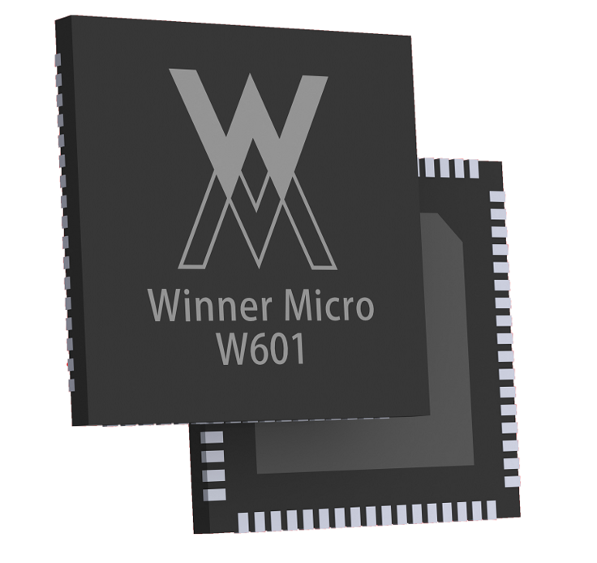

W601 wifi 芯片
==============

概述
------------
W601 Wi-Fi MCU 是一款支持多功能接口的 SoC 芯片。可作为主控芯片应用于智能家电、智能家居、智能玩具、医疗监护、工业控制等物联网领域 。该SoC 芯片集成 Cortex-M3 内核，内置Flash，支持 SDIO、SPI、UART、GPIO、I²C、PWM、I²S、7816、LCD、ADC 等丰富的接口, 支持多种硬件加解密协议，如PRNG/SHA1/MD5/RC4/DES/3DES/AES/CRC/RSA 等；支持 IEEE802.11b/g/n 国际标准。集成射频收发前端RF Transceiver，PA功率放大器，基带处理器/媒体访问控制。

W601是一款支持多接口、多协议的无线局域网 IEEE802.11n（1T1R）的 SoC 芯片。适用于智能家 电、智能家居、无线音视频、智能玩具、医疗监护、工业控制等物联网应用领域。

资料下载
---------
.. toctree::

   soc开发文档下载 </download/soc.rst>